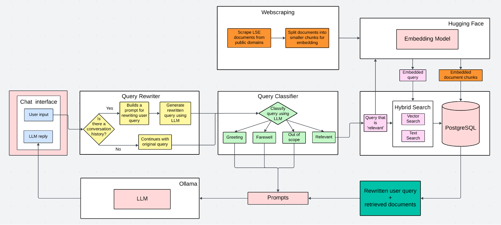

# 💬 ChatLSE

_Total Contributors:_
<!-- ALL-CONTRIBUTORS-BADGE:START - Do not remove or modify this section -->
[](#contributors-)
<!-- ALL-CONTRIBUTORS-BADGE:END -->

**Table of Contents:**

  - [About the Project](#-about-the-project)
  - [The Team](#-the-team)
  - [Contributing](#-contributing)
  - [Get in Touch](#%EF%B8%8F-get-in-touch)
  - [Contributors](#-contributors)

## 💡 About the Project
The _ChatLSE_ project is a proof of concept of a full data pipeline to index data from LSE websites. In this project, we gathered all public LSE documents and webpages into a database and then develop a chat interface using an LLM. Think of it as a ChatGPT meant to be particularly knowledgeable of LSE documents. Utilising retrieval augmented generation (RAG), the ChatLSE chatbot is capable of answering queries from staff and students by consulting relevant LSE documents and regulations. 

As all parts of this application are completely open-source, this project also aims to serve as a blueprint for a fully open-source RAG solution. The full workflow of the projcet is illlustrated below



## 🧑‍💻 The Team

_ChatLSE_ was initially created by a small team from the [LSE Data Science Institute](https://www.lse.ac.uk/dsi) over the summer of 2024. 
We now hope to make it open-source and community-driven to allow everyone to contribute to this project. 
Everyone who contributes to this project, no matter how small or big their contributions are, is recognised in this project as a contributor and a community member. 

The project is coordinated and managed by [Jonathan Cardoso-Silva](https://github.com/jonjoncardoso). 

Please see the [Contributors Table](#-contributors) for the GitHub profiles of all our contributors.

## 🔧 Contributing 

:construction: This repository is always a work in progress and **everyone** is encouraged to help us build something that is useful to the many. :construction:

Everyone who joins the project should check out our [contributing guidelines](CONTRIBUTING.md) for more information on how to get started.

Community members are provided with opportunities to learn new skills, share their ideas and collaborate with others.

## ✉️ Get in Touch

You can contact the ChatLSE team by emailing [j.cardoso-silva@lse.ac.uk](mailto:j.cardoso-silva@lse.ac.uk?subjet=[ChatLSE]%20-).

## ✨ Contributors

Thanks goes to these wonderful people ([emoji key](https://allcontributors.org/docs/en/emoji-key)):

<!-- ALL-CONTRIBUTORS-LIST:START - Do not remove or modify this section -->
<!-- prettier-ignore-start -->
<!-- markdownlint-disable -->
<table>
  <tbody>
    <tr>
      <td align="center" valign="top" width="14.28%"><a href="https://github.com/tz1211"><br /><sub><b>Terry Zhou</b></sub></a><br /><a href="https://github.com/LSE-DSI/chat-lse/issues?q=author%3Atz1211" title="Bug reports">🐛</a> <a href="https://github.com/LSE-DSI/chat-lse/commits?author=tz1211" title="Code">💻</a> <a href="#data-tz1211" title="Data">🔣</a> <a href="https://github.com/LSE-DSI/chat-lse/commits?author=tz1211" title="Documentation">📖</a> <a href="#ideas-tz1211" title="Ideas, Planning, & Feedback">🤔</a> <a href="https://github.com/LSE-DSI/chat-lse/pulls?q=is%3Apr+reviewed-by%3Atz1211" title="Reviewed Pull Requests">👀</a></td>
      <td align="center" valign="top" width="14.28%"><a href="https://github.com/jonjoncardoso"><br /><sub><b>Jon Cardoso-Silva</b></sub></a><br /><a href="https://github.com/LSE-DSI/chat-lse/commits?author=jonjoncardoso" title="Code">💻</a> <a href="https://github.com/LSE-DSI/chat-lse/commits?author=jonjoncardoso" title="Documentation">📖</a> <a href="#ideas-jonjoncardoso" title="Ideas, Planning, & Feedback">🤔</a> <a href="https://github.com/LSE-DSI/chat-lse/pulls?q=is%3Apr+reviewed-by%3Ajonjoncardoso" title="Reviewed Pull Requests">👀</a> <a href="#mentoring-jonjoncardoso" title="Mentoring">🧑‍🏫</a> <a href="#projectManagement-jonjoncardoso" title="Project Management">📆</a></td>
      <td align="center" valign="top" width="14.28%"><a href="https://github.com/akshsabherwal"><br /><sub><b>akshsabherwal</b></sub></a><br /><a href="https://github.com/LSE-DSI/chat-lse/issues?q=author%3Aakshsabherwal" title="Bug reports">🐛</a> <a href="https://github.com/LSE-DSI/chat-lse/commits?author=akshsabherwal" title="Code">💻</a> <a href="https://github.com/LSE-DSI/chat-lse/commits?author=akshsabherwal" title="Documentation">📖</a> <a href="#ideas-akshsabherwal" title="Ideas, Planning, & Feedback">🤔</a> <a href="https://github.com/LSE-DSI/chat-lse/pulls?q=is%3Apr+reviewed-by%3Aakshsabherwal" title="Reviewed Pull Requests">👀</a></td>
      <td align="center" valign="top" width="14.28%"><a href="https://github.com/KristinaD1910"><br /><sub><b>KristinaD1910</b></sub></a><br /><a href="https://github.com/LSE-DSI/chat-lse/issues?q=author%3AKristinaD1910" title="Bug reports">🐛</a> <a href="https://github.com/LSE-DSI/chat-lse/commits?author=KristinaD1910" title="Code">💻</a> <a href="#data-KristinaD1910" title="Data">🔣</a> <a href="https://github.com/LSE-DSI/chat-lse/commits?author=KristinaD1910" title="Documentation">📖</a> <a href="#ideas-KristinaD1910" title="Ideas, Planning, & Feedback">🤔</a> <a href="https://github.com/LSE-DSI/chat-lse/pulls?q=is%3Apr+reviewed-by%3AKristinaD1910" title="Reviewed Pull Requests">👀</a></td>
      <td align="center" valign="top" width="14.28%"><a href="https://github.com/Mayazure"><br /><sub><b>Jinshuai Ma</b></sub></a><br /><a href="https://github.com/LSE-DSI/chat-lse/commits?author=Mayazure" title="Code">💻</a> <a href="https://github.com/LSE-DSI/chat-lse/commits?author=Mayazure" title="Documentation">📖</a> <a href="#example-Mayazure" title="Examples">💡</a> <a href="#infra-Mayazure" title="Infrastructure (Hosting, Build-Tools, etc)">🚇</a> <a href="#mentoring-Mayazure" title="Mentoring">🧑‍🏫</a></td>
      <td align="center" valign="top" width="14.28%"><a href="https://github.com/RiyaChhikara"><br /><sub><b>Riya Chhikara</b></sub></a><br /><a href="https://github.com/LSE-DSI/chat-lse/commits?author=RiyaChhikara" title="Code">💻</a> <a href="#data-RiyaChhikara" title="Data">🔣</a> <a href="https://github.com/LSE-DSI/chat-lse/commits?author=RiyaChhikara" title="Documentation">📖</a> <a href="#mentoring-RiyaChhikara" title="Mentoring">🧑‍🏫</a></td>
      <td align="center" valign="top" width="14.28%"><a href="https://github.com/gaoonline"><br /><sub><b>Kylin Gao</b></sub></a><br /><a href="#ideas-gaoonline" title="Ideas, Planning, & Feedback">🤔</a> <a href="https://github.com/LSE-DSI/chat-lse/commits?author=gaoonline" title="Tests">⚠️</a></td>
    </tr>
    <tr>
      <td align="center" valign="top" width="14.28%"><a href="https://github.com/aliceandchains"><br /><sub><b>Alexey Burmistrov</b></sub></a><br /><a href="#ideas-aliceandchains" title="Ideas, Planning, & Feedback">🤔</a> <a href="https://github.com/LSE-DSI/chat-lse/commits?author=aliceandchains" title="Tests">⚠️</a></td>
    </tr>
  </tbody>
  <tfoot>
    <tr>
      <td align="center" size="13px" colspan="7">
        
          <a href="https://all-contributors.js.org/docs/en/bot/usage">Add your contributions</a>
        </img>
      </td>
    </tr>
  </tfoot>
</table>

<!-- markdownlint-restore -->
<!-- prettier-ignore-end -->


# TO BE REMOVED LATER !!! 

## ⚙️ Setup

### Requirements

- [Miniconda](https://docs.conda.io/en/latest/miniconda.html)
- [VSCode](https://code.visualstudio.com/)
- [Git](https://git-scm.com/)
- [Jupyter Extension](https://marketplace.visualstudio.com/items?itemName=ms-toolsai.jupyter) extension for VSCode
- [GitHub Pull Requests and Issues](https://marketplace.visualstudio.com/items?itemName=GitHub.vscode-pull-request-github) extension for VSCode

### VS Code setup

1. Git clone the repository to your `~/Workspace` folder

2. Open a fresh new VSCode window (to avoid conflicts with other projects). You can do this by clicking on 'File' -> 'New Window'.

3. Now click on 'File' -> 'Add Folder to Workspace' and select the folder you just cloned.

4. Open the terminal in VSCode by clicking on 'Terminal' -> 'New Terminal' and run the following commands to create a conda environment:

```bash
conda create -n chat-lse python=3.11 ipython
conda activate chat-lse # or the equivalent for your OS
```

5. (Important) Ensure that `pip` refers to the pip inside the conda environment we just created:

```bash
which pip
```

 this should output something like `/home/your-username/miniconda3/envs/chat-lse/bin/pip`

6. Assuming you've fixed the `pip` path, install the required packages:

```bash
pip install -r requirements.txt
```

## Running the crawler

1. First, ensure you have activated the `chat-lse` conda environment.

2. Run the following command from the root of the project to save the scraped data to a JSON file:

```bash
scrapy crawl lse_crawler
```

3. Run the following command from the root of the project to download all the documents:

```bash
scrapy crawl file_downloader
```

Note: with the current configuration, the crawler will save the data to `data/output.jl`(JSON Lines format). Read about scrapy's [item exporters](https://docs.scrapy.org/en/latest/topics/exporters.html#using-item-exporters) for more information.

<!-- ALL-CONTRIBUTORS-LIST:END -->

This project follows the [all-contributors](https://github.com/all-contributors/all-contributors) specification. Contributions of any kind welcome!
