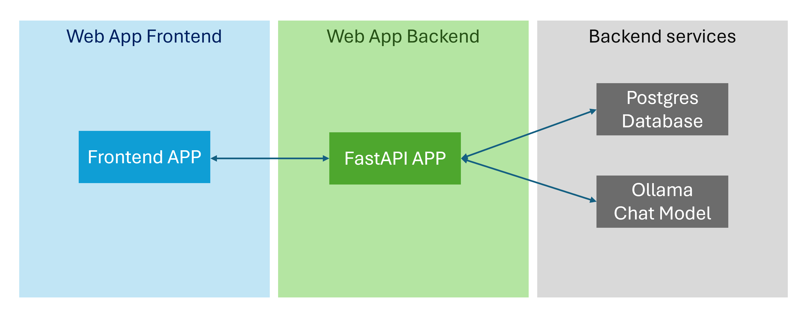

# Chat LSE development setup guide

**This document is for development setup only. For deployment, refer to deployment instructions.**

## Introduction

The Chat LSE Project is based on the [Rag on Postgres](https://github.com/pamelafox/rag-on-postgres) project with modifictaions to adapt to LSE's development and production environment.

Major modifications are: 

- Removed all Azure components
- Removed all VSCode-related configurations
- Removed dependency on close-sourced OpenAI chat and embedding models

The code has been tested on Windows 11, Ubuntu 20.04 LTS and MacOS(M2).

## Architecture and structure

The overall architecture of the app is shown in the figure:



There are 4 main components, the Frontend APP (FluentUI, React JS), the backend APP (FastAPI), PostgresSQL database and Ollama service. 

To run the full app, all four components have to be setup properly either on a local development machine or on a remote server. 

For development purpose, the frontend APP, backend APP and PostgresSQL should always be setup on a local machine. 

Ollama could be setup locally or use the remote setup on Rizzie. 

## Requirements

Make sure the following software are properly installed on your OS: 

- [VSCode](https://code.visualstudio.com/)
- [Docker](https://docs.docker.com/engine/install/)
- [npm](https://docs.npmjs.com/downloading-and-installing-node-js-and-npm)

## 1. Setup PostgresSQL locally

Run PostrgesSQL using docker container:

```bash
$ docker run -itd --name chatlse-postgres --restart unless-stopped -p 5432:5432 -e POSTGRES_PASSWORD=chatlse -e POSTGRES_USER=chatlse -e POSTGRES_DB=chatlse -d pgvector/pgvector:0.7.1-pg16
```

To verify the container is up and running:

```bash
$ docker ps -a

CONTAINER ID   IMAGE                          COMMAND                  CREATED         STATUS         PORTS                                       NAMES
45d7301f5ef8   pgvector/pgvector:0.7.1-pg16   "docker-entrypoint.s…"   2 seconds ago   Up 2 seconds   0.0.0.0:5432->5432/tcp, :::5432->5432/tcp   chatlse-postgres
```

The STATUS of the container shoule be something like "Up 2 seconds".

## 2. (Optionally) Setup Ollama locally

Download [Ollama](https://ollama.com/download) or pull its docker image using: 

CPU only: 
```bash
$ docker run -d -v ollama:/root/.ollama -p 11434:11434 --name ollama ollama/ollama
```

Nvidia GPU 
```bash
docker run -d --gpus=all -v ollama:/root/.ollama -p 11434:11434 --name ollama ollama/ollama
```

## 3. Setup environment

### 3.1 Install Python dependencies

Open the terminal in VSCode by clicking on 'Terminal' -> 'New Terminal' and create a virtual environment. 

```bash
# Use conda as an example. Can also use other virtual environments like venv

conda create -n chat-lse python=3.11 ipython
conda activate chat-lse # or the equivalent for your OS
```

(Important) Ensure that `pip` refers to the pip inside the conda environment we just created:

```bash
which pip
```

Install dependencies

```bash
pip install -r requirements.txt
```

### 3.2 Config environment variables

Copy **.env.sample** into **.env**.

#### Set Postgres Host

```
# For local setup
POSTGRES_HOST=localhost
```

```
# Rizzie setup, for testing and deployment only
POSTGRES_HOST=<Rizzie IP address>
```

#### Set Ollama Host

```
# For local setup. Only use this if you have local Ollama running.
OLLAMA_ENDPOINT=http://localhost:11434/v1
```

```
# For Rizzie setup
OLLAMA_ENDPOINT=http://<Rizzie IP address>:11434/v1
```

## 4. Initialise the database

### 4.1 Create a table from scratch

**Only run the command below if you are OK with wiping out your entire Postgres database!** We don't yet have a clear routine for simply updating the database, but it will be available soon!

```bash
ipython fastapi_app/setup_postgres_database.py
```

### 4.2 (Optional) Produce a JSON with embeddings for a sample of PDF documents

The reason this is optional is that you can just simply download the `seed_lse_data.jsonl` file from [Sharepoint > ChatLSE > pdf-chunking-experiments](https://lsecloud.sharepoint.com/:f:/r/sites/TEAM_DSI-Executive/Shared%20Documents/Computing/ChatLSE/pdf-chunking-experiments?csf=1&web=1&e=pdMAIb) (last updated: 1 July 2024) [^1].

- Open [fastapi_app/setup_seeeddata_lse.py](https://github.com/LSE-DSI/chat-lse/blob/develop/fastapi_app/setup_seeddata_lse.py) 
- Add the following to your .env file: 

    ```
    EMBED_CHUNK_SIZE=512 
    EMBED_OVERLAP_SIZE=128
    ```

- Run the script and wait until it is complete (it might take a few minutes).

[^1]: Check [fastapi_app/setup_seeeddata_lse.py](https://github.com/LSE-DSI/chat-lse/blob/develop/fastapi_app/setup_seeddata_lse.py) to understand how the JSON Lines files were created from the sample PDF documents.

### 4.3 Add sample documents to Postgres

Ensure you have the `data/seed_lse_data.jsonl` file and then run:

```bash
ipython fastapi_app/setup_postgres_seeddata.py
```


## 5. Start the FastAPI APP

We need our API to be running in the background, to handle requests from the website to LLAMA and Postgres:

```bash 
sh ./scripts/start_fastapi_app.sh
```

You should see something like:

```bash
INFO:     Will watch for changes in these directories: ['<your-path-to>/chat-lse']
INFO:     Uvicorn running on http://127.0.0.1:8000 (Press CTRL+C to quit)
INFO:     Started reloader process [7609] using WatchFiles
WARNING:  ASGI app factory detected. Using it, but please consider setting the --factory flag explicitly.
INFO:     Started server process [7611]
INFO:     Waiting for application startup.
INFO:ragapp:Authenticating to PostgreSQL using password...
INFO:ragapp:Authenticating to OpenAI using Ollama...
INFO:ragapp:Authenticating to OpenAI using Ollama...
INFO:     Application startup complete.
```

## 6. Setup and run Frontend APP

### 6.1 Install npm dependencies

```bash
# Go to chat-lse/frontend
cd frontend 
npm install
```

You might see the following warning. We can ignore it for now.

```bash
1 moderate severity vulnerability

To address all issues, run:
  npm audit fix

Run `npm audit` for details.
```

### 6.2 Start the frontend APP

Open a new terminal and run:

```bash
# Go to chat-lse/frontend
$ cd frontend 
$ npm run dev
```

You should see something like:

```bash
> frontend@0.0.0 dev
> vite


  VITE v4.5.2  ready in 309 ms

  ➜  Local:   http://localhost:5173/
  ➜  Network: use --host to expose
  ➜  press h to show help
```

## 6.3 Use the APP

Open http://localhost:5173/ in the web browser to try the app.
